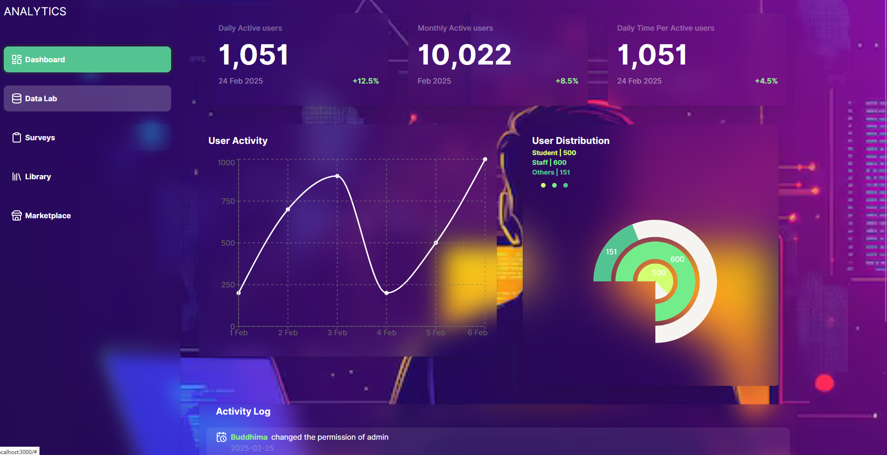
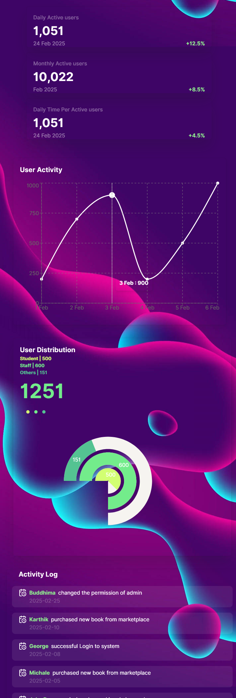

# Analytics Dashboard

This project is an **Analytics Dashboard** built using **React.js**, **Chakra UI**, **lucide-react**, and **Recharts** to visualize user activity and analytics data.




## Features
- **Data Visualization:** Displays key metrics like daily active users, monthly active users, and user distribution.
- **Interactive Charts:** Utilizes `Recharts` for displaying user activity trends.
- **Responsive Design:** Adapts to different screen sizes using Chakra UI's breakpoints.
- **UI Accessibility Standards:** Implements best practices for accessibility.
- **Sidebar Navigation:** Includes sections like Dashboard, Data Lab, Surveys, Library, and Marketplace.

## Tech Stack
- **React.js** – Frontend library
- **Chakra UI** – Component-based styling
- **lucide-react** – Icon library
- **Recharts** – Data visualization

## Installation
Follow these steps to run the project locally:

1. **Clone the repository:**
   ```bash
   git clone <repo-url>
   cd analytics-dashboard
   ```
2. **Install dependencies:**
   ```bash
   npm install
   ```
3. **Run the development server:**
   ```bash
   npm start
   ```
4. Open [http://localhost:3000](http://localhost:3000) in your browser.

## Responsiveness
This dashboard is designed to be fully responsive with two breakpoints:
- **Base (Mobile View)**
- **md (Tablet/Desktop View)**

Chakra UI's responsive design utilities ensure a seamless user experience across different screen sizes.

## UI Accessibility Standards
The application follows key UI accessibility standards:
- Proper color contrast to enhance readability.
- Keyboard navigation support.
- Use of semantic HTML elements.
- `aria-labels` for improving screen reader compatibility.

## Contributing
Feel free to fork this repository and submit a pull request with improvements.

## License
This project is licensed under the **MIT License**.

---

**Developed with ❤️ using React.js, Chakra UI, and Recharts.**

